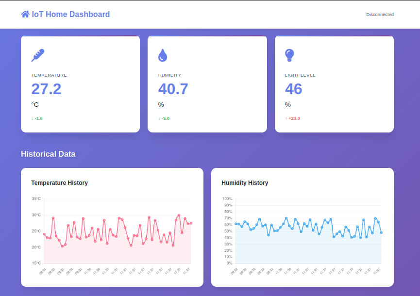
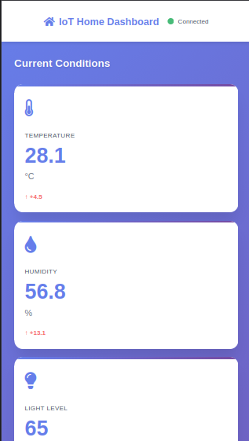

# IoT Web Dashboard

> Real-time web-based monitoring platform for IoT sensor networks


## 📋 Overview

A lightweight, responsive web dashboard for monitoring IoT sensor data in real-time. Built with Flask backend and vanilla JavaScript frontend - no heavy frameworks needed.

**Perfect for:**
- Home automation monitoring
- Environmental data tracking
- Learning web development + IoT integration
- Rapid prototyping of monitoring systems

---

## ✨ Features

### Real-Time Monitoring
- ✅ Live sensor readings (temperature, humidity, light)
- ✅ Auto-updates every 2 seconds
- ✅ Visual trend indicators (up/down/stable arrows)
- ✅ Connection status indicator

### Data Visualization
- ✅ Interactive line charts (Chart.js)
- ✅ 50-reading historical view
- ✅ Smooth animations and transitions
- ✅ Responsive design (mobile-friendly)

### Backend Features
- ✅ RESTful API endpoints
- ✅ SQLite database persistence
- ✅ Simulated sensor data (for demo)
- ✅ Easy to integrate real sensors

---

## 🎨 Theme Support

### Dark Mode
Toggle between light and dark themes with a single click.

**Features:**
- Persistent theme preference (localStorage)
- Smooth transitions
- Dynamic chart colors
- Accessible contrast ratios
- Mobile-optimized


**Implementation:**
- Pure CSS (no external libraries)
- JavaScript localStorage API
- Event-driven theme switching

---

## 🛠️ Tech Stack

| Layer | Technology | Purpose |
|-------|------------|---------|
| Backend | Flask | Web server & API |
| Database | SQLite | Data persistence |
| Frontend | HTML/CSS/JS | User interface |
| Visualization | Chart.js | Graphs & charts |

**Why this stack?**
- **Lightweight:** No heavy frameworks (React, Vue, etc.)
- **Simple:** Vanilla JavaScript = easy to understand
- **Fast:** SQLite = no database server needed
- **Scalable:** Easy to add more sensors/features

---

## 🚀 Installation

### Prerequisites
- Python 3.8+
- pip (Python package manager)
- Modern web browser

### Quick Start

```bash
# Clone repository
git clone https://github.com/yourusername/iot-web-dashboard.git
cd iot-web-dashboard

# Install dependencies
pip install flask

# Run server
python app.py
```

Open browser: `http://localhost:5000`

That's it! Dashboard should be running with simulated data.

---

## 📖 Usage

### Basic Operation

**Start server:**
```bash
python app.py
```

Dashboard automatically:
- Updates current readings every 2 seconds
- Refreshes charts every 10 seconds
- Stores all readings in database
- Calculates statistics (averages, totals)

### API Endpoints

#### Get current reading
```http
GET /api/current
```

**Response:**
```json
{
  "timestamp": "2024-12-31 14:30:45",
  "temperature": 24.3,
  "humidity": 55.8,
  "light": 67
}
```

#### Get historical data
```http
GET /api/history
```

**Response:** Array of last 50 readings
```json
[
  {
    "id": 1,
    "timestamp": "2024-12-31 14:30:43",
    "temperature": 24.1,
    "humidity": 56.2,
    "light": 65
  }
]
```

### Integrating Real Sensors

Replace simulated data in `app.py`:

**Current (simulated):**
```python
def get_sensor_reading():
    return {
        'temperature': round(random.uniform(20, 30), 1),
        # ...
    }
```

**Replace with real sensor (example: Arduino via serial):**
```python
import serial

def get_sensor_reading():
    ser = serial.Serial('/dev/ttyUSB0', 9600)
    line = ser.readline().decode('utf-8').strip()
    temp, humid, light = line.split(',')
    return {
        'temperature': float(temp),
        'humidity': float(humid),
        'light': int(light)
    }
```

---

## 📊 Screenshots

### Dashboard Overview

*Desktop View*


*Mobile View*

---

## 🏗️ Architecture

```
┌─────────────────────────────────────────────┐
│              Web Browser                    │
│  ┌────────────────────────────────────┐     │
│  │  HTML (Structure)                  │     │
│  │  CSS (Styling)                     │     │
│  │  JavaScript (Interactivity)        │     │
│  │  Chart.js (Visualization)          │     │
│  └────────────────────────────────────┘     │
└─────────────────┬───────────────────────────┘
                  │ HTTP Requests
                  │ (AJAX/Fetch API)
┌─────────────────▼───────────────────────────┐
│           Flask Web Server                  │
│  ┌────────────────────────────────────┐     │
│  │  Routes (/, /api/current,          │     │
│  │          /api/history)             │     │
│  │  Sensor simulation                 │     │
│  │  JSON responses                    │     │
│  └────────────────────────────────────┘     │
└─────────────────┬───────────────────────────┘
                  │ SQL Queries
┌─────────────────▼───────────────────────────┐
│           SQLite Database                   │
│  ┌────────────────────────────────────┐     │
│  │  sensor_data table                 │     │
│  │  (id, timestamp, temp,             │     │
│  │   humidity, light)                 │     │
│  └────────────────────────────────────┘     │
└─────────────────────────────────────────────┘
```

---

## 🎨 Customization

### Add More Sensors

**1. Update database schema:**
```python
# In init_db():
conn.execute('''
    CREATE TABLE sensor_data (
        id INTEGER PRIMARY KEY AUTOINCREMENT,
        timestamp TEXT NOT NULL,
        temperature REAL,
        humidity REAL,
        light INTEGER,
        co2 INTEGER  -- Add new column
    )
''')
```

**2. Update API response:**
```python
def get_sensor_reading():
    return {
        'temperature': round(random.uniform(20, 30), 1),
        'humidity': round(random.uniform(40, 70), 1),
        'light': random.randint(30, 80),
        'co2': random.randint(400, 1200)  # Add new sensor
    }
```

**3. Update frontend** (HTML + CSS + JS)

### Change Update Frequency

In `dashboard.js`:
```javascript
const CONFIG = {
    updateInterval: 5000,      // Change to 5 seconds
    chartUpdateInterval: 30000, // Change to 30 seconds
};
```

### Modify Chart Appearance

In `dashboard.js` → `initCharts()`:
```javascript
borderColor: 'rgb(YOUR_COLOR)',
backgroundColor: 'rgba(YOUR_COLOR, 0.1)',
```

---

## 🔮 Future Enhancements

- [ ] User authentication (login system)
- [ ] Alerts/notifications (email, push)
- [ ] Data export (CSV, JSON)
- [ ] Comparison mode (multi-location)
- [ ] Mobile app (React Native)
- [ ] Dark mode toggle
- [ ] Historical date range picker
- [ ] Predictive analytics (ML)

---

## 🐛 Troubleshooting

### Dashboard not loading
- Check Flask server is running (`python app.py`)
- Verify no port conflicts (port 5000 in use?)
- Check browser console for errors (F12)

### Charts not updating
- Check browser console for API errors
- Verify `/api/history` returns data
- Check JavaScript console logs

### Database errors
- Delete `iot_data.db` and restart (creates fresh database)
- Check file permissions

---

## 🤝 Contributing

Contributions are welcome! Please feel free to submit a Pull Request.

1. Fork the project
2. Create your feature branch (`git checkout -b feature/AmazingFeature`)
3. Commit your changes (`git commit -m 'Add some AmazingFeature'`)
4. Push to the branch (`git push origin feature/AmazingFeature`)
5. Open a Pull Request

---

## 👤 Author

**allkinn**  
Physics Student | Full-Stack IoT Developer

**Connect:**
- 📧 Email: -
- 💼 LinkedIn: [linkedin.com/in/yourprofile]
- 🐙 GitHub: [@allkinn](https://github.com/allkinn)

---

## 📄 License

This project is licensed under the MIT License - see the [LICENSE](LICENSE) file for details.

---

## 🙏 Acknowledgments

- Chart.js for excellent visualization library
- Flask team for the lightweight framework
- IoT community for inspiration

---

<div align="center">

**⭐ If you find this useful, please star the repo!**

**🐛 Issues?** [Report here](https://github.com/allkinn/iot-web-dashboard/issues)

*Built with ❤️ for the IoT community*

</div>
